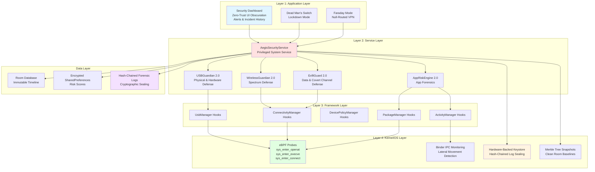
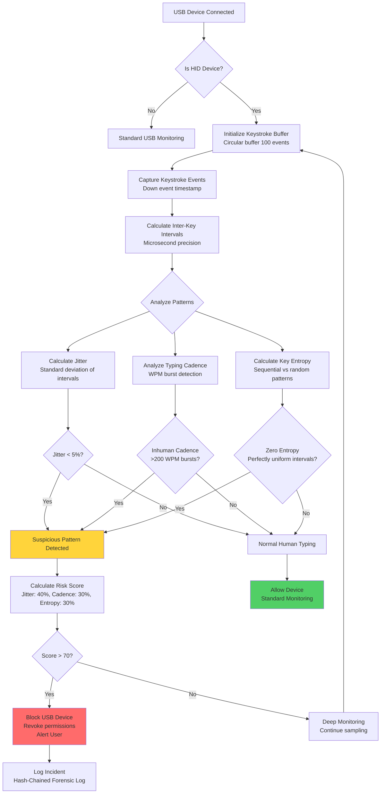
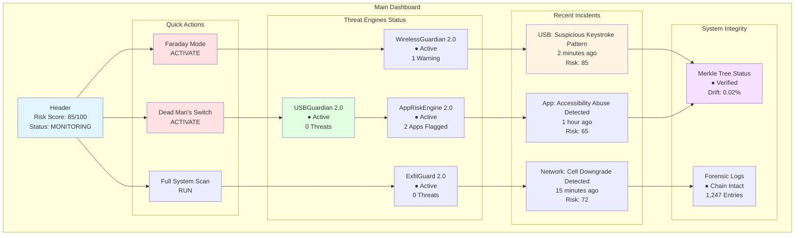

# PROJECT AEGIS - Engineering Blueprint
## Advanced Android Defensive Security Platform

### Core Defensive Philosophy
**DETECT → BLOCK → ISOLATE → RECORD → ANALYZE → ALERT → RECOVER**

- NO offensive operations
- NO hacking back
- NO attacking the attacker
- Purely defensive: detection, blocking, isolation, forensic analysis

---

## 1. System Architecture Diagram



---

## 2. Keystroke Microsecond Dynamics Logic Flow



---

## 3. Hash-Chained Log Sealing Data Schema

```kotlin
// Core Forensic Log Entry
data class ForensicLogEntry(
    val eventId: String,                    // UUID v4
    val timestamp: Long,                     // Unix epoch milliseconds
    val eventType: LogEventType,             // enum: USB, NETWORK, APP, SYSTEM
    val severity: Severity,                  // enum: INFO, WARNING, CRITICAL
    val metadata: Map<String, Any>,         // Event-specific data
    val riskScore: Int,                      // 0-100
    val previousHash: String,                 // Previous entry's SHA-256
    val currentHash: String,                 // SHA-256(eventId + timestamp + metadata + previousHash)
    val signature: String,                   // Hardware-backed Keystore signature
    val integrityVerified: Boolean           // Chain integrity check
)

// Hash Chain Structure
data class LogChain(
    val chainId: String,                     // Chain identifier
    val genesisHash: String,                 // First entry's hash
    val currentHead: String,                 // Latest entry's hash
    val entryCount: Int,                     // Total entries
    val lastVerified: Long,                 // Last verification timestamp
    val tamperDetected: Boolean              // Tamper flag
)

// Merkle Tree Snapshot for Clean Room Baselines
data class SystemSnapshot(
    val snapshotId: String,
    val timestamp: Long,
    val snapshotType: SnapshotType,         // PRE_SERVICE, POST_SERVICE
    val rootHash: String,                    // Merkle root
    val directoryHashes: Map<String, String>, // Path -> SHA-256
    val driftDelta: Float,                   // Change percentage from baseline
    val chainRef: String                     // Reference to log chain
)

enum class LogEventType {
    USB_DEVICE_CONNECTED,
    USB_DEVICE_DISCONNECTED,
    USB_SUSPICIOUS_ACTIVITY,
    NETWORK_CONNECTION,
    DNS_QUERY,
    TLS_HANDSHAKE,
    APP_INSTALL,
    APP_UNINSTALL,
    APP_PERMISSION_CHANGE,
    SYSTEM_INTEGRITY_CHECK,
    INCIDENT_RESPONSE
}

enum class Severity {
    INFO,
    WARNING,
    HIGH,
    CRITICAL
}

enum class SnapshotType {
    PRE_SERVICE,
    POST_SERVICE,
    MANUAL
}
```

---

## 4. Required Android Framework APIs & eBPF Hooks

### Android Framework APIs

**USB Monitoring:**
- `UsbManager` - Device enumeration, permission management
- `UsbDevice` - Device metadata (VID, PID, interfaces)
- `UsbInterface` - Interface descriptors
- `UsbEndpoint` - Endpoint details for HID analysis
- `InputManager` - Input event interception for keystroke timing

**Network Monitoring:**
- `ConnectivityManager` - Network state changes
- `NetworkCapabilities` - Network type validation
- `LinkProperties` - DNS, routing info
- `TrafficStats` - Per-UID traffic monitoring
- `VpnService` - Faraday Mode null-routing

**App Security:**
- `PackageManager` - APK metadata, signature verification
- `ApplicationInfo` - App flags, permissions
- `PackageInfo` - Signature hash, requested permissions
- `UsageStatsManager` - App usage patterns
- `AccessibilityService` - Detect accessibility abuse

**System Controls:**
- `DevicePolicyManager` - Device admin functions
- `KeyguardManager` - Lock screen control
- `WindowManager` - UI obscuration
- `PowerManager` - Screen dimming
- `BiometricPrompt` - Biometric control

**Hardware Security:**
- `KeyStore` - Hardware-backed cryptographic operations
- `KeyGenParameterSpec` - Key generation with hardware backing
- `KeyInfo` - Verify hardware backing
- `FingerprintManager` - Biometric state

### eBPF Hooks (Root Required)

**System Call Hooks:**
```c
// File system monitoring for supply-chain attacks
SEC("sys_enter_openat")
int sys_enter_openat(struct pt_regs *ctx) {
    // Log file opens, detect suspicious paths
    // Calculate entropy of executables
}

// Process execution monitoring
SEC("sys_enter_execve")
int sys_enter_execve(struct pt_regs *ctx) {
    // Track process spawning
    // Detect fileless malware (memfd)
    // Log parent-child relationships
}

// Network connection monitoring
SEC("sys_enter_connect")
int sys_enter_connect(struct pt_regs *ctx) {
    // Monitor outbound connections
    // Detect covert channels
    // Log IP/port combinations
}

// ptrace abuse detection
SEC("sys_enter_ptrace")
int sys_enter_ptrace(struct pt_regs *ctx) {
    // Detect debugging/injection attempts
    // Identify process injection
}
```

**Binder IPC Monitoring:**
```c
// Monitor inter-process communication
SEC("binder_transaction")
int binder_transaction(struct pt_regs *ctx) {
    // Detect lateral movement
    // Identify suspicious IPC patterns
    // Log service requests
}
```

---

## 5. UI Dashboard Layout



---

## 6. Implementation Modules

### Module Structure
```
app/src/main/java/com/example/aegis/
├── core/
│   ├── AegisSecurityService.kt          # Main security service
│   ├── ForensicLogger.kt                # Hash-chained logging
│   ├── KeystoreManager.kt               # Hardware-backed crypto
│   └── MerkleTreeSnapshot.kt            # System integrity
├── usb/
│   ├── USBGuardian.kt                   # USB monitoring
│   ├── KeystrokeAnalyzer.kt             # Microsecond dynamics
│   └── USBDeviceManager.kt              # Device enumeration
├── wireless/
│   ├── WirelessGuardian.kt              # Network monitoring
│   ├── CellularDowngradeDetector.kt     # IMSI catcher detection
│   └── BSSIDProfiler.kt                 # WiFi spoofing detection
├── exfil/
│   ├── ExfilGuard.kt                    # Data exfiltration detection
│   ├── DNSTunnelingDetector.kt          # DNS tunnel detection
│   └── TLSFingerprinter.kt              # JA3/JA3S fingerprinting
├── app/
│   ├── AppRiskEngine.kt                 # App forensics
│   ├── APKAnalyzer.kt                   # APK metadata analysis
│   └── AccessibilityAbuseDetector.kt   # Accessibility abuse
├── response/
│   ├── DeadMansSwitch.kt                # Lockdown mode
│   ├── FaradayMode.kt                   # Null-routed VPN
│   └── IncidentResponder.kt             # Automated response
└── ui/
    ├── dashboard/
    │   ├── DashboardScreen.kt           # Main dashboard
    │   ├── ThreatEngineStatus.kt        # Engine status cards
    │   └── IncidentList.kt              # Incident history
    └── components/
        ├── RiskScoreCard.kt             # Risk score display
        └── QuickActions.kt              # Action buttons
```

---

## 7. Threat Detection Logic Summary

### USBGuardian 2.0
- **Standard Detection**: Unknown VID/PID, unauthorized ADB, composite devices
- **Advanced Detection**: 
  - Keystroke jitter < 5% (inhuman consistency)
  - Typing cadence > 200 WPM bursts
  - Zero entropy in timing patterns
  - USB-C PD voltage anomalies
  - Composite interface fuzzing

### WirelessGuardian 2.0
- **Standard Detection**: Evil twins, rogue Bluetooth, unauthorized VPNs
- **Advanced Detection**:
  - Cellular 5G/4G → 2G downgrades (IMSI catchers)
  - BSSID historical profiling (spoofing detection)
  - Spectrum anomaly detection

### ExfilGuard 2.0
- **Standard Detection**: Volume spikes, suspicious routing
- **Advanced Detection**:
  - DNS tunneling (high entropy payloads, abnormal frequency)
  - JA3/JA3S TLS fingerprinting (malware libraries)
  - Covert channel detection

### AppRiskEngine 2.0
- **Standard Detection**: APK metadata, accessibility abuse, device-admin abuse
- **Advanced Detection**:
  - TFLite memory-map analysis
  - Packer/obfuscator entropy detection
  - Fileless malware indicators (memfd, ptrace abuse)

---

## 8. Incident Response Modes

### Dead Man's Switch (Lockdown Mode)
- Trigger: CRITICAL physical risk
- Actions:
  - Zero-Trust UI Obscuration (dim screen)
  - Disable biometrics
  - Force alphanumeric PIN
  - Block all USB devices
  - Lock device admin

### Faraday Mode
- Trigger: CRITICAL wireless risk
- Actions:
  - Deploy null-routed local VPN
  - Blackhole all outbound traffic
  - Disable WiFi/Bluetooth
  - Force cellular only
  - Block network changes

### Clean Room Baselines
- Pre-service cryptographic snapshot
- Post-service cryptographic snapshot
- Merkle tree comparison
- Drift delta calculation
- Supply-chain tampering detection

---

## 9. Security Considerations

1. **Hardware-Backed Crypto**: All cryptographic operations use Android Keystore with hardware backing when available
2. **Hash-Chained Logs**: Each log entry includes previous hash, creating tamper-evident chain
3. **Merkle Tree Snapshots**: System integrity verification using cryptographic trees
4. **Zero-Trust Architecture**: No implicit trust, continuous verification
5. **Defense in Depth**: Multiple detection layers, no single point of failure
6. **Privacy Preservation**: No data leaves device, local processing only
7. **Anti-Tampering**: Code obfuscation, root detection, integrity checks

---

## 10. Build & Deployment

### Requirements
- Android 7.0+ (API 24+) minimum
- Android 14+ (API 34+) recommended for full features
- Root access required for eBPF hooks (optional mode without root)
- Hardware-backed Keystore required for full security

### Dependencies
- AndroidX Compose for UI
- Room for local database
- Kotlin Coroutines for async operations
- eBPF libraries (kernel 5.4+)
- TensorFlow Lite for ML-based detection

### Signing
- Release builds must be signed with release keystore
- Debug builds use debug keystore
- APK signature verification for app analysis
